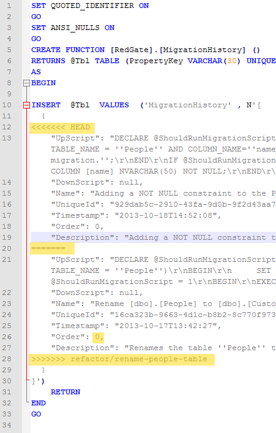
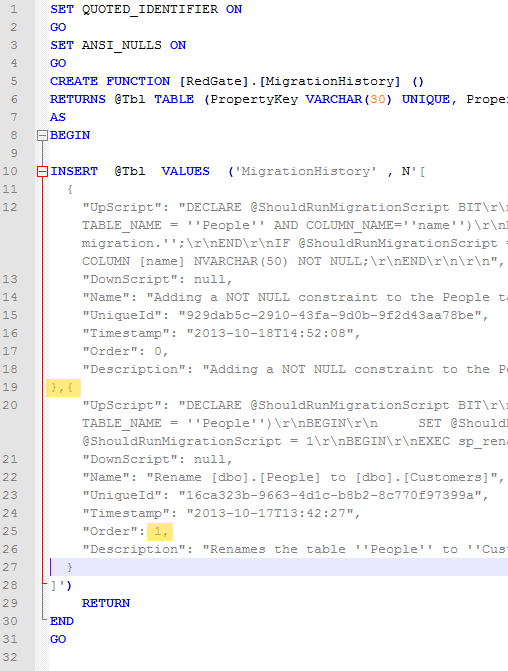

## Overview

This example repository accompanies a demo video for Red Gate SQL SQL Source Control Migrations v2.  It's showing how to work through a scenario where two developers have created migration scripts in different git branches and you need to merge them together.

- You are playing the part of a developer who will add a migration script to add a NOT NULL constraint to an existing column 
- You then 'find' another developer has renamed the table you are working on in another branch

You can watch the demo video on YouTube [TODO: LINK]

If you would like to setup the scenario for yourself and then step through the demo you can clone this repository and follow the instructions below.

## Setup

These instructions create a set-up the same as the start of the video.

- Repository setup
	- Clone this repository to your local machine
	- Fetch and create a tracking copy of the 'refactor/rename-people-table' branch
	- Make sure your working copy is a checked out version of the 'master' branch

```
$ git clone git@github.com:jonathanhickford/migrations-v2-demo.git
$ cd .\migrations-v2-demo
$ git checkout refactor/rename-people-table
$ git checkout master
```

- Database setup
	- Create three databases
		- migrations-demo-dev
		- migrations-demo-uat
		- migrations-demo-cli
	- Run the three scripts in the setup_scripts folder to populate these with data (including NULL values)

- SQL Source Control setup
	- Link the 'migrations-demo-dev' database to the db_source_control folder with SQL Source Control

## Demo Scenario Instructions

### Check everything is setup
- Your working copy is on the 'master' branch of this repository
- You have three databases which are all identical from a schema point of view
	- They contain one table called 'People' with an 'id' and a 'name' column.  
	- The 'name' column  currently accepts NULLs
	- There is data in all three tables including at least one NULL value for 'name'
- Your 'migrations-demo-dev' database is linked to SQL Source Control, there are no changes on the Commit or  the Get Latest tab

```
$ git branch
* master
  refactor/rename-people-table
```

### Create your branch and make your migration
	
- Create a new branch and check it out, call this branch 'feature/not-null'

```
$ git branch feature/not-null
$ git checkout feature/not-null
$ git branch
* feature/not-null
  master
  refactor/rename-people-table
```

- Open SSMS and select your 'migrations-demo-dev' database
- Open the SQL Source Control tab
- Create a new migration script, name it 'Adding a NOT NULL constraint to the People table'
- Paste in the contents of the 'sample_not_null_column_migration.sql'.  This script contains:
	- A guard clause, checking that the 'People' table and 'name' column are present in the database
	- There is a line to set any NULL names to 'unknown name'
	- There is a line to alter the name column to forbid NULL values
- Run the script on your database by pressing F5
- Save the migration script
- Go to the commit tab and save the changes (migrations history, Red Gate schema)
- Open your git client and add and commit these changes

```
$ git add .
$ git commit . -m 'Added migration script to add NOT NULL constraint to the name column'
```

### Merge your changes and existing changes into the master branch

At this stage in the demo you want to deploy your changes and any other changes to the UAT environment.  However you now 'notice' that there have been changes on another branch that also need deploying.  These other changes rename the table that you were just working on, also using a migration script.  As your script references the current name of the table you want to run your changes first, then the other developers changes.

- Merge your changes into the master branch by switching to 'master' then merging your changes in from the 'feature/not-null' branch
- Merge the other changes into the master branch from the 'refactor/rename-people-table'.  This will cause a conflict in db_source_control/functions/RedGate.MigrationHistory.sql
- Open db_source_control/functions/RedGate.MigrationHistory.sql in a text editor of your choice.
	- This conflict is a standard git file conflict due to having different conflicting edits between the branches.  It's not a conflict between your local database and the master branch.
	- Fixing this is a little fiddly...  This Table Value Function contains a JSON array in which we're storing information about the migrations, and it's now had both changes merged together.  There are four things to check/fix (see image below).
		- Check that the section of JSON with the name 'Adding a NOT NULL constraint to the People table' is above the other block of JSON
		- The blocks will be seperated by a line that will read read '======='.  Replace that with a closing curly bracket, a comma, and an opening curly bracket between the two array elements, e.g. '},{'  (without the quotes)
		- Change the value of the 'Order' parameter.  They will both be set to zero currently.  You want 'Adding a NOT NULL constraint to the People table' to run first, so leave that as '0' (without the quotes).  Change the order value in the other block to be '1' (without the quotes).
		- Remove the lines showing '<<<<<<< HEAD' and  '>>>>>>> refactor/change-table-name' that are above and below the conflicted sections
	- Save this file and mark the conflicts resolved
	- Commit this file, along with the other changes.  There will be one files added to master and one deleted
		- Added RedGate.MigrationHistory.sql - now with the conflicts resolved
		- Deleted Persons.sql - removing the old table which will not be required after the rename

```
$ git checkout master
$ git merge feature/not-null
$ git merge refactor/rename-people-table
# Resolve conflict here...
$ git commit .  -m 'Merged feature/not-null and refactor/rename-people-table into master.  Resolved conflicts'
```

**Before Merge**



**After Merge**


				

### Update your dev environment to have the latest changes

- Open SSMS and select 'get latest' tab.  Press the 'get latest' button
- This will bring in the new migration script to rename People to Customers
- Refresh the object browser and check that your table has renamed and the 'name' column still has the NOT NULL constraint you added

### Use SQL Compare GUI to deploy these changes to UAT

- Launch SQL Compare
- On the left select Source Control, and the scripts folder option
- Select the db_source_control folder
- On the right select your local database
- Select the 'migrations-demo-uat' database
- Run the comparison
- Select all changes
- Deploy now
- View your script.  The NOT NULL changes will be ahead of the sp_rename
- Deploy
- Open SSMS and check the UAT database has a Customers table, and that the name that was previously NULL is now 'unknown name'

### Use SQL Compare Command line to deploy these changes to your CLI environment (Extra Credit) 

```
.\SQLCompare.exe /scripts1:"D:\workspace\migrations-demo\db_source_control" /server2:SERVERNAME\SQL2012 /database2:migrations-demo-cli /sync
```


